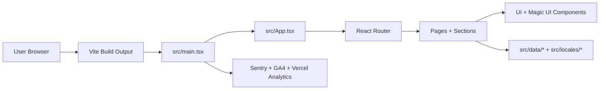

# 🏛️ Portfolio Architecture (ARCHITECTURE.md)

This document provides a technical overview of the Portfolio application. It is designed to help human developers and AI agents understand how the app is structured, how data flows, and where to find things.

## 1. High-Level Overview

This is a Single Page Application (SPA) built with React 19, bundled by Vite, and relying heavily on static client-side rendering with dynamic animations. There is no traditional backend; all data is strictly contained within TypeScript files in `src/data/`.

**Core Technologies:**

- **Core**: React 19, TypeScript
- **Build Tool**: Vite
- **Styling**: Tailwind CSS v4, shadcn/ui, `tailwind-merge`, `clsx`
- **Routing**: `react-router-dom`
- **State Management**: React Hooks (useState, useEffect, custom hooks)
- **Animations**: Framer Motion (`motion`), Magic UI, `rough-notation`
- **Analytics & Observability**: Sentry, Vercel Analytics, React GA4

## 2. Directory Structure

```text
src/
├── assets/         # Static global assets (images, SVGs)
├── components/     # Reusable building blocks
│   ├── ui/         # Base UI components (often generated by shadcn/ui)
│   └── magicui/    # Complex, highly animated components (Terminal, Globe)
├── data/           # The Single Source of Truth for content
│   ├── copy.ts     # User-facing text, witty copy, and configuration string constants
│   └── resume.ts   # Employment history, education, and skills data
├── hooks/          # Custom React hooks containing shared logic
├── lib/            # Utility functions (e.g., `cn` for className merging)
├── locales/        # i18next translation JSON files (en, es, fr, de)
├── pages/          # Top-level route components (e.g., Home.tsx)
├── sections/       # Distinct sections composing a page (e.g., Hero, About, Projects)
├── App.tsx         # Main application wrapper and global layout
└── main.tsx        # Application entry point, Router setup, Analytics init
```

## 2.1 Visual Site Map (Routes)

```mermaid
flowchart TD
  A[andressuarez.dev/] --> B[/]
  A --> C[/projects]
  A --> D[/oss]
  A --> E[/contact]
  A --> F[/case-studies/:id]
  F --> G[/case-studies/sentir-creativo]
  F --> H[/case-studies/proaxdata]
  A -. noindex .-> I[/blog]
```

> SEO note: `/blog` is intentionally marked as `noindex` in the page metadata while it's in “coming soon” mode.

## 2.2 Visual Runtime Architecture



## 3. Data Flow & State Management

The application completely abstracts content from components.

- **Content as Code**: All text, project data, and resume information reside in `src/data/`.
  - _Why?_ This separation allows components to remain purely presentational. If you need to fix a typo or add a new job experience, you never need to touch a React component.
- **State**: The app is generally stateless beyond UI-level state (e.g., is a dialog open, has an animation finished, is the loading screen active). Global state is extremely minimal.

## 4. Component Hierarchy & Rendering

- **`main.tsx`**: Initializes external tools (Sentry, Analytics), mounts the React Router, and renders `<App />`.
- **`App.tsx`**: Orchestrates global concerns (Theme providers, Toast notifications from `sonner`, the global `LoadingScreen` component) and contains the main `<Routes>` map.
- **`pages/Home.tsx`**: A composition of multiple section components imported from `src/sections/`.
- **Sections**: Each section (e.g., `HeroSection`, `ExperienceSection`) fetches its required data from `src/data/` and maps that data into `components/ui` or `components/magicui`.

## 5. Styling Paradigm

We use **Tailwind CSS**.

- **Consistency**: All styling mutations or overrides should be done via Tailwind utility classes.
- **Class Merging**: We use the `cn` utility (from `clsx` + `tailwind-merge`) found in `src/lib/utils.ts` to merge external classes safely.
  ```ts
  // Example usage
  import { cn } from "@/lib/utils"
  export function MyComponent({ className }: { className?: string }) {
    return <div className={cn("base-classes", className)} />
  }
  ```

## 6. Animations

Animations define the personality of this app.

- **Micro-interactions**: Handled primarily via Tailwind pseudo-classes (`hover:`, `focus:`) and simple Framer Motion configurations (`whileHover`, `whileTap`).
- **Scroll & Reveal**: Handled by components like `BlurFade` (fades in when scrolled into view).
- **Complex UI**: Handled by Magic UI components. If you are modifying complex components like the interactive terminal, rely on the Magic UI abstraction rather than writing custom animation frames.

## 7. Adding New Features (Agent Guide)

When instructed to add a new feature:

1. **Model the Data**: Does this feature require new text? Add it to `src/data/`. If it's UI layout text, add it to `src/locales/`.
2. **Build the UI**: Create a new component in `src/components/ui/` (if it's a building block) or `src/sections/` (if it's a major page area).
3. **Assemble**: Import your section into `src/pages/Home.tsx` and wrap it in `BlurFade` for consistent loading animations.
4. **Style**: Use Tailwind CSS strictly. Do not add raw CSS files unless an extremely specific animation cannot be handled by Framer Motion or Tailwind.

## 8. Main Dependencies

Why are they awesome for this portfolio?

- **Tailwind CSS v4 & shadcn/ui**: Tailwind provides a highly flexible and fast utility-first styling system, completely eliminating the mental overhead of naming CSS classes. `shadcn/ui` builds on this, providing beautiful, accessible, and customizable components that we own entirely in the codebase.
- **Framer Motion & Magic UI**: These bring the portfolio to life. They allow complex, highly performant micro-interactions and stunning visual effects (like the globe, marquee, or terminal loading screen) with relatively little code, creating a premium feel.
- **Sentry**: Critical for observability. It captures edge-case errors silently in the background, ensuring that user experiences aren't completely broken without us knowing. It allows for professional-grade error handling and session replays.
- **i18next / react-i18next**: We use this to smoothly handle multiple languages (English, Spanish, French, German). Coupled with language detectors, it instantly adjusts the portfolio to the user's preferred language, offering a far more personalized experience on a global scale.
- **React Router v6**: Provides seamless, entirely client-side navigation between different parts of the portfolio (like the Blog and Case Studies) without requiring slow page reloads, maintaining the fast SPA experience.

By adhering to this structure, the portfolio remains maintainable, scalable, and true to its technical vision.
